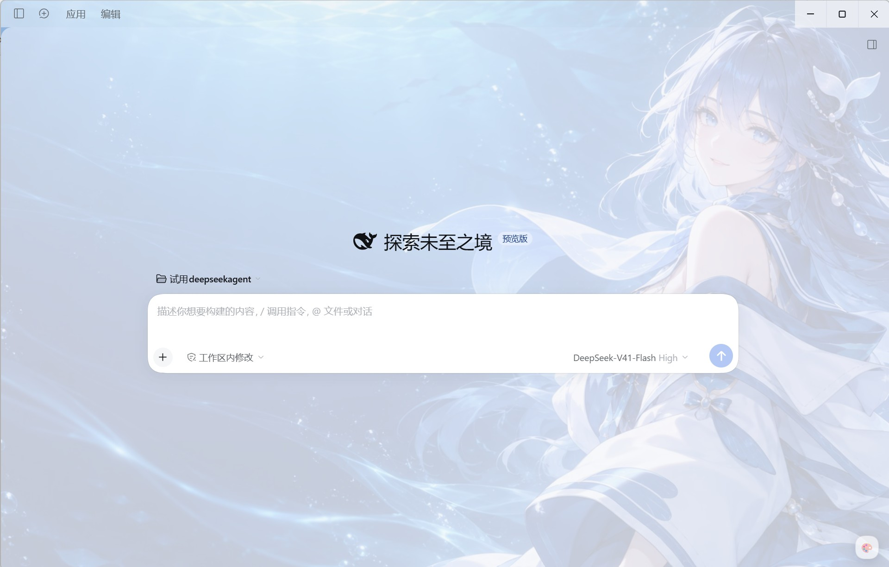
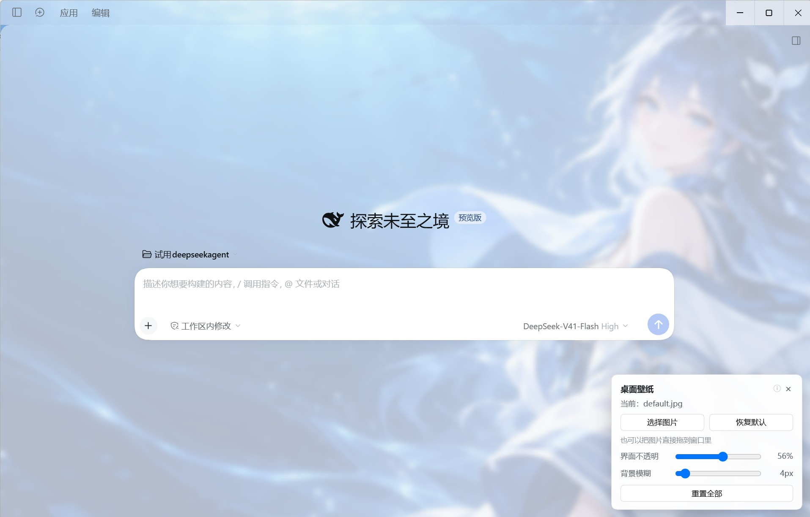

# dsh-desktop-wallpaper

> **DeepSeek Harness** 的壁纸插件：换任意图片、调整界面透出程度、给背景加模糊——全部实时生效，不用重启。

[English](README.md) | 简体中文

## 效果截图



*图片铺在界面之下；右下角的 🎨 按钮打开控制面板。*



*控制面板：选择图片（或把图片拖到窗口里），再调界面不透明度与背景模糊——拖动时即时预览。*

## 功能

- **手动换图** —— 用文件对话框选择，或把图片**直接拖到窗口任意位置**。图片会自动降采样
  （最长边 ≤2560px、JPEG q0.85）并存在应用自己的存储里，因此宿主不需要往磁盘写任何文件。
- **界面不透明度**（0–100%）—— 0% 是纯壁纸，100% 接近原版观感。
- **背景模糊**（0–60px）—— 只模糊壁纸层，界面始终清晰。
- **实时预览** —— 两个滑块拖动过程中即时重绘。
- **记住设置**，重启应用后自动恢复，并提供一键重置。
- **健康自检** —— 面板平时保持干净，只有某项检查真的失败时才出现一行提示。
- **无运行时依赖、无构建步骤** —— 一个宿主文件、一个浏览器文件。

## 环境要求

- DSH **0.2.0-rc.2**（已实测）。支持的版本范围写在 `peerDependencies`（`@deepseek-ai/dsh`）里；
  在不被支持的运行时上，DSH 的兼容性策略会**拒绝加载**并打印授权精确版本豁免的方法。

## 安装

```sh
# 装默认分支的最新版
dsh plugin --profile <profile> install github:tt-zjy/dsh-desktop-wallpaper

# 钉住某个发布版本
dsh plugin --profile <profile> install github:tt-zjy/dsh-desktop-wallpaper#v1.0.0
```

装完重启 DSH（除非插件管理器提示已热应用）。

> **桌面应用用户请注意**：桌面应用的 `profiles/desktop/cordis.patch.yml` 归应用自己所有、
> 启动时会被重写，装进那个文件的条目可能下次启动就没了。建议把条目放进 home 用户层
> （`$DSH_HOME/cordis.patch.yml`），或者直接用应用内的插件界面安装。

## 使用

点右下角的 **🎨** 按钮：

| 控件 | 作用 |
| --- | --- |
| 选择图片 / 恢复默认 | 更换或撤销壁纸（系统文件对话框，或把图片拖到窗口里） |
| 界面不透明 | 界面让壁纸透出多少 |
| 背景模糊 | 只作用于壁纸层的模糊半径 |
| 重置全部 | 回到默认值 |

面板参数按窗口来源保存，重启后会自动恢复。

## 可选配置

随包默认壁纸是 `assets/default.jpg`（1672×941）。在旁边放一张 `default.png` 或 `default.svg`
也可以，按 jpg → png → svg 的顺序取用；三个都没有时插件不会改动界面。
想指定自己的文件，在 patch 条目上写 `imagePath`：

```yaml
- insert:
    - id: desktop-wallpaper
      name: dsh-desktop-wallpaper
      inject: [webServer, fs]
      config:
        imagePath: C:\pictures\my-wallpaper.jpg   # 可选
```

## 工作原理

- **宿主半边**（`lib/index.js`）注册几条普通 HTTP 路由：`/dsh-desktop-wallpaper/image` 提供壁纸
  （每次请求实时读盘），`/mark`、`/status`、`/request` 承载自检数据。
- **浏览器半边**（`lib/client.js`）运行在应用窗口里。它建立一个独立的固定定位背景层
  （所以模糊永远不会糊到界面），并覆盖 `--dsw-alias-*` 主题 token 让界面面板半透明。
  token 用两条路径下发——注入样式表 **和** 在 `body` 上写内联 `!important`——因为实测只有
  内联那一路能稳定压过主题自己的样式表。

需要宿主半边的原因：桌面外壳的窗口 HTML 来自打包好的静态资源，宿主端的 HTML 注入到不了它；
而任何非静态路径都会被外壳转发回宿主。

## 已知限制

提 issue 前请先看这几条：

1. **依赖未公开的内部契约**：`--dsw-alias-*` 这组 token 名、`window.__ModuleLoader__.load({ id, factory })`
   bundle 约定、以及 `dsh-app:` 外壳协议。它们不是公开 API，**未来的 DSH 版本可能让它失效**。
   `peerDependencies` 版本范围就是为这个准备的：不匹配的运行时宁可拒绝加载，也不会半残地跑起来。
2. **它会向页面注入界面并用 `!important` 覆盖主题 token**。这是壁纸在这里的实现方式所决定的；
   它不读取你的任何数据，除了自己的设置也不写任何东西。
3. **改代码需要重启**：浏览器 bundle 的地址带宿主启动时算出的内容哈希，只有重启才会下发新 bundle。
   改设置则从不需要重启。
4. 只在 Windows 上实测过。路径都走 DSH 的 `fs` 服务，理论上 macOS/Linux 可用，但未验证。

## 开发

```sh
npm run verify     # 语法检查 + 单元测试（无需安装依赖）
```

目录结构：`lib/index.js`（宿主）、`lib/client.js`（浏览器）、`tests/unit.cjs`（假 DOM 单测）、
`scripts/set-package-name.mjs`（一次改完所有需要一致的包名位置）。
浏览器 bundle 必须保持的约定、以及如何对着真实 DSH 调试，见 [CONTRIBUTING.md](CONTRIBUTING.md)。

## 许可证

[MIT](LICENSE)。随包默认壁纸（`assets/default.jpg`）为 AI 生成，以同一许可证提供；
如果你替换它，请确认你对该图片有再分发权。
